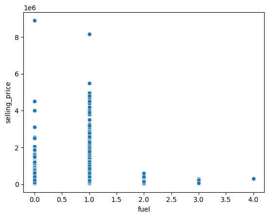
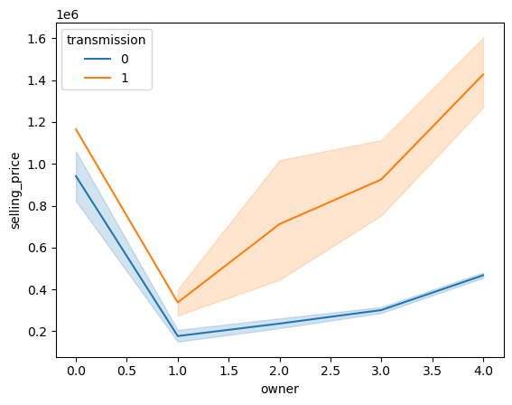
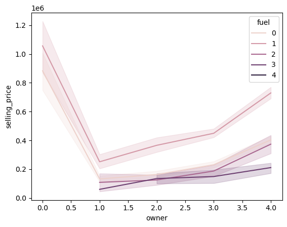
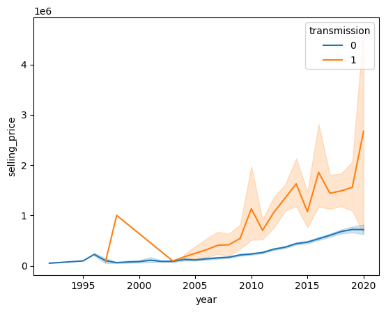
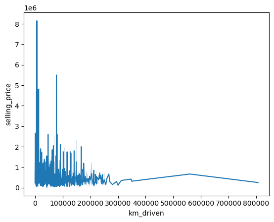

```python
import numpy as np
import pandas as pd
import matplotlib.pyplot as plt
import seaborn as sns

from sklearn.impute import SimpleImputer
from sklearn.preprocessing import LabelEncoder
```


```python
data = pd.read_csv("CAR DETAILS FROM CAR DEKHO.csv")
```


```python
data
```


<div>
<style scoped>
    .dataframe tbody tr th:only-of-type {
        vertical-align: middle;
    }

    .dataframe tbody tr th {
        vertical-align: top;
    }

    .dataframe thead th {
        text-align: right;
    }
</style>
<table border="1" class="dataframe">
  <thead>
    <tr style="text-align: right;">
      <th></th>
      <th>name</th>
      <th>year</th>
      <th>selling_price</th>
      <th>km_driven</th>
      <th>fuel</th>
      <th>seller_type</th>
      <th>transmission</th>
      <th>owner</th>
    </tr>
  </thead>
  <tbody>
    <tr>
      <th>0</th>
      <td>Maruti 800 AC</td>
      <td>2007</td>
      <td>60000</td>
      <td>70000</td>
      <td>Petrol</td>
      <td>Individual</td>
      <td>Manual</td>
      <td>First Owner</td>
    </tr>
    <tr>
      <th>1</th>
      <td>Maruti Wagon R LXI Minor</td>
      <td>2007</td>
      <td>135000</td>
      <td>50000</td>
      <td>Petrol</td>
      <td>Individual</td>
      <td>Manual</td>
      <td>First Owner</td>
    </tr>
    <tr>
      <th>2</th>
      <td>Hyundai Verna 1.6 SX</td>
      <td>2012</td>
      <td>600000</td>
      <td>100000</td>
      <td>Diesel</td>
      <td>Individual</td>
      <td>Manual</td>
      <td>First Owner</td>
    </tr>
    <tr>
      <th>3</th>
      <td>Datsun RediGO T Option</td>
      <td>2017</td>
      <td>250000</td>
      <td>46000</td>
      <td>Petrol</td>
      <td>Individual</td>
      <td>Manual</td>
      <td>First Owner</td>
    </tr>
    <tr>
      <th>4</th>
      <td>Honda Amaze VX i-DTEC</td>
      <td>2014</td>
      <td>450000</td>
      <td>141000</td>
      <td>Diesel</td>
      <td>Individual</td>
      <td>Manual</td>
      <td>Second Owner</td>
    </tr>
    <tr>
      <th>...</th>
      <td>...</td>
      <td>...</td>
      <td>...</td>
      <td>...</td>
      <td>...</td>
      <td>...</td>
      <td>...</td>
      <td>...</td>
    </tr>
    <tr>
      <th>4335</th>
      <td>Hyundai i20 Magna 1.4 CRDi (Diesel)</td>
      <td>2014</td>
      <td>409999</td>
      <td>80000</td>
      <td>Diesel</td>
      <td>Individual</td>
      <td>Manual</td>
      <td>Second Owner</td>
    </tr>
    <tr>
      <th>4336</th>
      <td>Hyundai i20 Magna 1.4 CRDi</td>
      <td>2014</td>
      <td>409999</td>
      <td>80000</td>
      <td>Diesel</td>
      <td>Individual</td>
      <td>Manual</td>
      <td>Second Owner</td>
    </tr>
    <tr>
      <th>4337</th>
      <td>Maruti 800 AC BSIII</td>
      <td>2009</td>
      <td>110000</td>
      <td>83000</td>
      <td>Petrol</td>
      <td>Individual</td>
      <td>Manual</td>
      <td>Second Owner</td>
    </tr>
    <tr>
      <th>4338</th>
      <td>Hyundai Creta 1.6 CRDi SX Option</td>
      <td>2016</td>
      <td>865000</td>
      <td>90000</td>
      <td>Diesel</td>
      <td>Individual</td>
      <td>Manual</td>
      <td>First Owner</td>
    </tr>
    <tr>
      <th>4339</th>
      <td>Renault KWID RXT</td>
      <td>2016</td>
      <td>225000</td>
      <td>40000</td>
      <td>Petrol</td>
      <td>Individual</td>
      <td>Manual</td>
      <td>First Owner</td>
    </tr>
  </tbody>
</table>
<p>4340 rows × 8 columns</p>
</div>


```python
data.columns
```


    Index(['name', 'year', 'selling_price', 'km_driven', 'fuel', 'seller_type',
           'transmission', 'owner'],
          dtype='object')


```python
data.info()
```

    <class 'pandas.core.frame.DataFrame'>
    RangeIndex: 4340 entries, 0 to 4339
    Data columns (total 8 columns):
     #   Column         Non-Null Count  Dtype 
    ---  ------         --------------  ----- 
     0   name           4340 non-null   object
     1   year           4340 non-null   int64 
     2   selling_price  4340 non-null   int64 
     3   km_driven      4340 non-null   int64 
     4   fuel           4340 non-null   object
     5   seller_type    4340 non-null   object
     6   transmission   4340 non-null   object
     7   owner          4340 non-null   object
    dtypes: int64(3), object(5)
    memory usage: 271.4+ KB
    


```python
data.describe()
```


<div>
<style scoped>
    .dataframe tbody tr th:only-of-type {
        vertical-align: middle;
    }

    .dataframe tbody tr th {
        vertical-align: top;
    }

    .dataframe thead th {
        text-align: right;
    }
</style>
<table border="1" class="dataframe">
  <thead>
    <tr style="text-align: right;">
      <th></th>
      <th>year</th>
      <th>selling_price</th>
      <th>km_driven</th>
    </tr>
  </thead>
  <tbody>
    <tr>
      <th>count</th>
      <td>4340.000000</td>
      <td>4.340000e+03</td>
      <td>4340.000000</td>
    </tr>
    <tr>
      <th>mean</th>
      <td>2013.090783</td>
      <td>5.041273e+05</td>
      <td>66215.777419</td>
    </tr>
    <tr>
      <th>std</th>
      <td>4.215344</td>
      <td>5.785487e+05</td>
      <td>46644.102194</td>
    </tr>
    <tr>
      <th>min</th>
      <td>1992.000000</td>
      <td>2.000000e+04</td>
      <td>1.000000</td>
    </tr>
    <tr>
      <th>25%</th>
      <td>2011.000000</td>
      <td>2.087498e+05</td>
      <td>35000.000000</td>
    </tr>
    <tr>
      <th>50%</th>
      <td>2014.000000</td>
      <td>3.500000e+05</td>
      <td>60000.000000</td>
    </tr>
    <tr>
      <th>75%</th>
      <td>2016.000000</td>
      <td>6.000000e+05</td>
      <td>90000.000000</td>
    </tr>
    <tr>
      <th>max</th>
      <td>2020.000000</td>
      <td>8.900000e+06</td>
      <td>806599.000000</td>
    </tr>
  </tbody>
</table>
</div>


```python
data.shape
```


    (4340, 8)


```python
cars_name=data["name"].unique()
print("The Values in Deptname is:" , cars_name)
```

    The Values in Deptname is: ['Maruti 800 AC' 'Maruti Wagon R LXI Minor' 'Hyundai Verna 1.6 SX' ...
     'Mahindra Verito 1.5 D6 BSIII'
     'Toyota Innova 2.5 VX (Diesel) 8 Seater BS IV'
     'Hyundai i20 Magna 1.4 CRDi']
    


```python
Count_of_Car = data["name"].value_counts()
Count_of_Car = pd.DataFrame(Count_of_Car)
```


```python
Count_of_Car
```


<div>
<style scoped>
    .dataframe tbody tr th:only-of-type {
        vertical-align: middle;
    }

    .dataframe tbody tr th {
        vertical-align: top;
    }

    .dataframe thead th {
        text-align: right;
    }
</style>
<table border="1" class="dataframe">
  <thead>
    <tr style="text-align: right;">
      <th></th>
      <th>count</th>
    </tr>
    <tr>
      <th>name</th>
      <th></th>
    </tr>
  </thead>
  <tbody>
    <tr>
      <th>Maruti Swift Dzire VDI</th>
      <td>69</td>
    </tr>
    <tr>
      <th>Maruti Alto 800 LXI</th>
      <td>59</td>
    </tr>
    <tr>
      <th>Maruti Alto LXi</th>
      <td>47</td>
    </tr>
    <tr>
      <th>Maruti Alto LX</th>
      <td>35</td>
    </tr>
    <tr>
      <th>Hyundai EON Era Plus</th>
      <td>35</td>
    </tr>
    <tr>
      <th>...</th>
      <td>...</td>
    </tr>
    <tr>
      <th>Hyundai Verna Transform CRDi VGT SX ABS</th>
      <td>1</td>
    </tr>
    <tr>
      <th>Maruti S-Presso VXI Plus</th>
      <td>1</td>
    </tr>
    <tr>
      <th>Toyota Etios Liva 1.2 VX</th>
      <td>1</td>
    </tr>
    <tr>
      <th>Toyota Yaris G</th>
      <td>1</td>
    </tr>
    <tr>
      <th>Hyundai i20 Magna 1.4 CRDi</th>
      <td>1</td>
    </tr>
  </tbody>
</table>
<p>1491 rows × 1 columns</p>
</div>


```python
print("Have any missing values\n" , data.isnull().values.any())
```

    Have any missing values
     False
    


```python
data
```


<div>
<style scoped>
    .dataframe tbody tr th:only-of-type {
        vertical-align: middle;
    }

    .dataframe tbody tr th {
        vertical-align: top;
    }

    .dataframe thead th {
        text-align: right;
    }
</style>
<table border="1" class="dataframe">
  <thead>
    <tr style="text-align: right;">
      <th></th>
      <th>name</th>
      <th>year</th>
      <th>selling_price</th>
      <th>km_driven</th>
      <th>fuel</th>
      <th>seller_type</th>
      <th>transmission</th>
      <th>owner</th>
    </tr>
  </thead>
  <tbody>
    <tr>
      <th>0</th>
      <td>Maruti 800 AC</td>
      <td>2007</td>
      <td>60000</td>
      <td>70000</td>
      <td>Petrol</td>
      <td>Individual</td>
      <td>Manual</td>
      <td>First Owner</td>
    </tr>
    <tr>
      <th>1</th>
      <td>Maruti Wagon R LXI Minor</td>
      <td>2007</td>
      <td>135000</td>
      <td>50000</td>
      <td>Petrol</td>
      <td>Individual</td>
      <td>Manual</td>
      <td>First Owner</td>
    </tr>
    <tr>
      <th>2</th>
      <td>Hyundai Verna 1.6 SX</td>
      <td>2012</td>
      <td>600000</td>
      <td>100000</td>
      <td>Diesel</td>
      <td>Individual</td>
      <td>Manual</td>
      <td>First Owner</td>
    </tr>
    <tr>
      <th>3</th>
      <td>Datsun RediGO T Option</td>
      <td>2017</td>
      <td>250000</td>
      <td>46000</td>
      <td>Petrol</td>
      <td>Individual</td>
      <td>Manual</td>
      <td>First Owner</td>
    </tr>
    <tr>
      <th>4</th>
      <td>Honda Amaze VX i-DTEC</td>
      <td>2014</td>
      <td>450000</td>
      <td>141000</td>
      <td>Diesel</td>
      <td>Individual</td>
      <td>Manual</td>
      <td>Second Owner</td>
    </tr>
    <tr>
      <th>...</th>
      <td>...</td>
      <td>...</td>
      <td>...</td>
      <td>...</td>
      <td>...</td>
      <td>...</td>
      <td>...</td>
      <td>...</td>
    </tr>
    <tr>
      <th>4335</th>
      <td>Hyundai i20 Magna 1.4 CRDi (Diesel)</td>
      <td>2014</td>
      <td>409999</td>
      <td>80000</td>
      <td>Diesel</td>
      <td>Individual</td>
      <td>Manual</td>
      <td>Second Owner</td>
    </tr>
    <tr>
      <th>4336</th>
      <td>Hyundai i20 Magna 1.4 CRDi</td>
      <td>2014</td>
      <td>409999</td>
      <td>80000</td>
      <td>Diesel</td>
      <td>Individual</td>
      <td>Manual</td>
      <td>Second Owner</td>
    </tr>
    <tr>
      <th>4337</th>
      <td>Maruti 800 AC BSIII</td>
      <td>2009</td>
      <td>110000</td>
      <td>83000</td>
      <td>Petrol</td>
      <td>Individual</td>
      <td>Manual</td>
      <td>Second Owner</td>
    </tr>
    <tr>
      <th>4338</th>
      <td>Hyundai Creta 1.6 CRDi SX Option</td>
      <td>2016</td>
      <td>865000</td>
      <td>90000</td>
      <td>Diesel</td>
      <td>Individual</td>
      <td>Manual</td>
      <td>First Owner</td>
    </tr>
    <tr>
      <th>4339</th>
      <td>Renault KWID RXT</td>
      <td>2016</td>
      <td>225000</td>
      <td>40000</td>
      <td>Petrol</td>
      <td>Individual</td>
      <td>Manual</td>
      <td>First Owner</td>
    </tr>
  </tbody>
</table>
<p>4340 rows × 8 columns</p>
</div>


```python
dup_values = data.duplicated().sum()
```


```python
print("How many Duplicatid Values???\n" , "The number of Duplicated value is:" , dup_values)
```

    How many Duplicatid Values???
     The number of Duplicated value is: 763
    


```python
data = data.drop_duplicates()
```


```python
data
```


<div>
<style scoped>
    .dataframe tbody tr th:only-of-type {
        vertical-align: middle;
    }

    .dataframe tbody tr th {
        vertical-align: top;
    }

    .dataframe thead th {
        text-align: right;
    }
</style>
<table border="1" class="dataframe">
  <thead>
    <tr style="text-align: right;">
      <th></th>
      <th>name</th>
      <th>year</th>
      <th>selling_price</th>
      <th>km_driven</th>
      <th>fuel</th>
      <th>seller_type</th>
      <th>transmission</th>
      <th>owner</th>
    </tr>
  </thead>
  <tbody>
    <tr>
      <th>0</th>
      <td>Maruti 800 AC</td>
      <td>2007</td>
      <td>60000</td>
      <td>70000</td>
      <td>Petrol</td>
      <td>Individual</td>
      <td>Manual</td>
      <td>First Owner</td>
    </tr>
    <tr>
      <th>1</th>
      <td>Maruti Wagon R LXI Minor</td>
      <td>2007</td>
      <td>135000</td>
      <td>50000</td>
      <td>Petrol</td>
      <td>Individual</td>
      <td>Manual</td>
      <td>First Owner</td>
    </tr>
    <tr>
      <th>2</th>
      <td>Hyundai Verna 1.6 SX</td>
      <td>2012</td>
      <td>600000</td>
      <td>100000</td>
      <td>Diesel</td>
      <td>Individual</td>
      <td>Manual</td>
      <td>First Owner</td>
    </tr>
    <tr>
      <th>3</th>
      <td>Datsun RediGO T Option</td>
      <td>2017</td>
      <td>250000</td>
      <td>46000</td>
      <td>Petrol</td>
      <td>Individual</td>
      <td>Manual</td>
      <td>First Owner</td>
    </tr>
    <tr>
      <th>4</th>
      <td>Honda Amaze VX i-DTEC</td>
      <td>2014</td>
      <td>450000</td>
      <td>141000</td>
      <td>Diesel</td>
      <td>Individual</td>
      <td>Manual</td>
      <td>Second Owner</td>
    </tr>
    <tr>
      <th>...</th>
      <td>...</td>
      <td>...</td>
      <td>...</td>
      <td>...</td>
      <td>...</td>
      <td>...</td>
      <td>...</td>
      <td>...</td>
    </tr>
    <tr>
      <th>4335</th>
      <td>Hyundai i20 Magna 1.4 CRDi (Diesel)</td>
      <td>2014</td>
      <td>409999</td>
      <td>80000</td>
      <td>Diesel</td>
      <td>Individual</td>
      <td>Manual</td>
      <td>Second Owner</td>
    </tr>
    <tr>
      <th>4336</th>
      <td>Hyundai i20 Magna 1.4 CRDi</td>
      <td>2014</td>
      <td>409999</td>
      <td>80000</td>
      <td>Diesel</td>
      <td>Individual</td>
      <td>Manual</td>
      <td>Second Owner</td>
    </tr>
    <tr>
      <th>4337</th>
      <td>Maruti 800 AC BSIII</td>
      <td>2009</td>
      <td>110000</td>
      <td>83000</td>
      <td>Petrol</td>
      <td>Individual</td>
      <td>Manual</td>
      <td>Second Owner</td>
    </tr>
    <tr>
      <th>4338</th>
      <td>Hyundai Creta 1.6 CRDi SX Option</td>
      <td>2016</td>
      <td>865000</td>
      <td>90000</td>
      <td>Diesel</td>
      <td>Individual</td>
      <td>Manual</td>
      <td>First Owner</td>
    </tr>
    <tr>
      <th>4339</th>
      <td>Renault KWID RXT</td>
      <td>2016</td>
      <td>225000</td>
      <td>40000</td>
      <td>Petrol</td>
      <td>Individual</td>
      <td>Manual</td>
      <td>First Owner</td>
    </tr>
  </tbody>
</table>
<p>3577 rows × 8 columns</p>
</div>


```python
print("How many Duplicatid Values???\n" , "The number of Duplicated value is:" , data.duplicated().sum())
```

    How many Duplicatid Values???
     The number of Duplicated value is: 0
    


```python
Most_10_Cars = data.sort_values(by='selling_price' , ascending=False).head(10)
```


```python
Most_10_Cars
```


<div>
<style scoped>
    .dataframe tbody tr th:only-of-type {
        vertical-align: middle;
    }

    .dataframe tbody tr th {
        vertical-align: top;
    }

    .dataframe thead th {
        text-align: right;
    }
</style>
<table border="1" class="dataframe">
  <thead>
    <tr style="text-align: right;">
      <th></th>
      <th>name</th>
      <th>year</th>
      <th>selling_price</th>
      <th>km_driven</th>
      <th>fuel</th>
      <th>seller_type</th>
      <th>transmission</th>
      <th>owner</th>
    </tr>
  </thead>
  <tbody>
    <tr>
      <th>3872</th>
      <td>Audi RS7 2015-2019 Sportback Performance</td>
      <td>2016</td>
      <td>8900000</td>
      <td>13000</td>
      <td>Petrol</td>
      <td>Dealer</td>
      <td>Automatic</td>
      <td>First Owner</td>
    </tr>
    <tr>
      <th>89</th>
      <td>Mercedes-Benz S-Class S 350d Connoisseurs Edition</td>
      <td>2017</td>
      <td>8150000</td>
      <td>6500</td>
      <td>Diesel</td>
      <td>Dealer</td>
      <td>Automatic</td>
      <td>First Owner</td>
    </tr>
    <tr>
      <th>3969</th>
      <td>Mercedes-Benz GLS 2016-2020 350d 4MATIC</td>
      <td>2016</td>
      <td>5500000</td>
      <td>77350</td>
      <td>Diesel</td>
      <td>Dealer</td>
      <td>Automatic</td>
      <td>First Owner</td>
    </tr>
    <tr>
      <th>555</th>
      <td>BMW X5 xDrive 30d xLine</td>
      <td>2019</td>
      <td>4950000</td>
      <td>30000</td>
      <td>Diesel</td>
      <td>Dealer</td>
      <td>Automatic</td>
      <td>First Owner</td>
    </tr>
    <tr>
      <th>3883</th>
      <td>BMW 5 Series 520d Luxury Line</td>
      <td>2019</td>
      <td>4800000</td>
      <td>12999</td>
      <td>Diesel</td>
      <td>Dealer</td>
      <td>Automatic</td>
      <td>First Owner</td>
    </tr>
    <tr>
      <th>3453</th>
      <td>BMW 5 Series 520d Luxury Line</td>
      <td>2018</td>
      <td>4800000</td>
      <td>9422</td>
      <td>Diesel</td>
      <td>Individual</td>
      <td>Automatic</td>
      <td>First Owner</td>
    </tr>
    <tr>
      <th>963</th>
      <td>Audi A5 Sportback</td>
      <td>2020</td>
      <td>4700000</td>
      <td>1500</td>
      <td>Diesel</td>
      <td>Individual</td>
      <td>Automatic</td>
      <td>First Owner</td>
    </tr>
    <tr>
      <th>101</th>
      <td>Mercedes-Benz E-Class Exclusive E 200 BSIV</td>
      <td>2018</td>
      <td>4500000</td>
      <td>9800</td>
      <td>Petrol</td>
      <td>Dealer</td>
      <td>Automatic</td>
      <td>First Owner</td>
    </tr>
    <tr>
      <th>4047</th>
      <td>Volvo XC 90 D5 Inscription BSIV</td>
      <td>2017</td>
      <td>4500000</td>
      <td>80000</td>
      <td>Diesel</td>
      <td>Individual</td>
      <td>Automatic</td>
      <td>First Owner</td>
    </tr>
    <tr>
      <th>539</th>
      <td>Mercedes-Benz GL-Class 350 CDI Blue Efficiency</td>
      <td>2014</td>
      <td>4400000</td>
      <td>100000</td>
      <td>Diesel</td>
      <td>Individual</td>
      <td>Automatic</td>
      <td>Second Owner</td>
    </tr>
  </tbody>
</table>
</div>


```python
least_10_Cars = data.sort_values(by='selling_price' , ascending=True).head(10)
```


```python
least_10_Cars
```


<div>
<style scoped>
    .dataframe tbody tr th:only-of-type {
        vertical-align: middle;
    }

    .dataframe tbody tr th {
        vertical-align: top;
    }

    .dataframe thead th {
        text-align: right;
    }
</style>
<table border="1" class="dataframe">
  <thead>
    <tr style="text-align: right;">
      <th></th>
      <th>name</th>
      <th>year</th>
      <th>selling_price</th>
      <th>km_driven</th>
      <th>fuel</th>
      <th>seller_type</th>
      <th>transmission</th>
      <th>owner</th>
    </tr>
  </thead>
  <tbody>
    <tr>
      <th>2662</th>
      <td>Ford Ikon 1.6 ZXI NXt</td>
      <td>2005</td>
      <td>20000</td>
      <td>25000</td>
      <td>Petrol</td>
      <td>Individual</td>
      <td>Manual</td>
      <td>Second Owner</td>
    </tr>
    <tr>
      <th>2495</th>
      <td>Ford Ikon 1.4 ZXi</td>
      <td>2000</td>
      <td>22000</td>
      <td>42743</td>
      <td>Petrol</td>
      <td>Dealer</td>
      <td>Manual</td>
      <td>Third Owner</td>
    </tr>
    <tr>
      <th>2444</th>
      <td>Maruti 800 EX</td>
      <td>2004</td>
      <td>30000</td>
      <td>60000</td>
      <td>Petrol</td>
      <td>Individual</td>
      <td>Manual</td>
      <td>Third Owner</td>
    </tr>
    <tr>
      <th>3206</th>
      <td>OpelCorsa 1.4 GL</td>
      <td>2002</td>
      <td>35000</td>
      <td>100000</td>
      <td>Petrol</td>
      <td>Individual</td>
      <td>Manual</td>
      <td>Third Owner</td>
    </tr>
    <tr>
      <th>1832</th>
      <td>Tata Nano LX SE</td>
      <td>2012</td>
      <td>35000</td>
      <td>35000</td>
      <td>Petrol</td>
      <td>Individual</td>
      <td>Manual</td>
      <td>Third Owner</td>
    </tr>
    <tr>
      <th>2849</th>
      <td>Tata Nano Std BSII</td>
      <td>2009</td>
      <td>35000</td>
      <td>50000</td>
      <td>Petrol</td>
      <td>Individual</td>
      <td>Manual</td>
      <td>Third Owner</td>
    </tr>
    <tr>
      <th>4290</th>
      <td>Maruti 800 Std</td>
      <td>2004</td>
      <td>37500</td>
      <td>90000</td>
      <td>Petrol</td>
      <td>Individual</td>
      <td>Manual</td>
      <td>Second Owner</td>
    </tr>
    <tr>
      <th>877</th>
      <td>Tata Nano Std</td>
      <td>2011</td>
      <td>40000</td>
      <td>19000</td>
      <td>Petrol</td>
      <td>Individual</td>
      <td>Manual</td>
      <td>First Owner</td>
    </tr>
    <tr>
      <th>3215</th>
      <td>Maruti 800 AC</td>
      <td>2004</td>
      <td>40000</td>
      <td>69111</td>
      <td>Petrol</td>
      <td>Individual</td>
      <td>Manual</td>
      <td>Third Owner</td>
    </tr>
    <tr>
      <th>1350</th>
      <td>Maruti 800 EX</td>
      <td>2001</td>
      <td>40000</td>
      <td>30000</td>
      <td>Petrol</td>
      <td>Individual</td>
      <td>Manual</td>
      <td>First Owner</td>
    </tr>
  </tbody>
</table>
</div>


```python
data
```


<div>
<style scoped>
    .dataframe tbody tr th:only-of-type {
        vertical-align: middle;
    }

    .dataframe tbody tr th {
        vertical-align: top;
    }

    .dataframe thead th {
        text-align: right;
    }
</style>
<table border="1" class="dataframe">
  <thead>
    <tr style="text-align: right;">
      <th></th>
      <th>name</th>
      <th>year</th>
      <th>selling_price</th>
      <th>km_driven</th>
      <th>fuel</th>
      <th>seller_type</th>
      <th>transmission</th>
      <th>owner</th>
    </tr>
  </thead>
  <tbody>
    <tr>
      <th>0</th>
      <td>Maruti 800 AC</td>
      <td>2007</td>
      <td>60000</td>
      <td>70000</td>
      <td>Petrol</td>
      <td>Individual</td>
      <td>Manual</td>
      <td>First Owner</td>
    </tr>
    <tr>
      <th>1</th>
      <td>Maruti Wagon R LXI Minor</td>
      <td>2007</td>
      <td>135000</td>
      <td>50000</td>
      <td>Petrol</td>
      <td>Individual</td>
      <td>Manual</td>
      <td>First Owner</td>
    </tr>
    <tr>
      <th>2</th>
      <td>Hyundai Verna 1.6 SX</td>
      <td>2012</td>
      <td>600000</td>
      <td>100000</td>
      <td>Diesel</td>
      <td>Individual</td>
      <td>Manual</td>
      <td>First Owner</td>
    </tr>
    <tr>
      <th>3</th>
      <td>Datsun RediGO T Option</td>
      <td>2017</td>
      <td>250000</td>
      <td>46000</td>
      <td>Petrol</td>
      <td>Individual</td>
      <td>Manual</td>
      <td>First Owner</td>
    </tr>
    <tr>
      <th>4</th>
      <td>Honda Amaze VX i-DTEC</td>
      <td>2014</td>
      <td>450000</td>
      <td>141000</td>
      <td>Diesel</td>
      <td>Individual</td>
      <td>Manual</td>
      <td>Second Owner</td>
    </tr>
    <tr>
      <th>...</th>
      <td>...</td>
      <td>...</td>
      <td>...</td>
      <td>...</td>
      <td>...</td>
      <td>...</td>
      <td>...</td>
      <td>...</td>
    </tr>
    <tr>
      <th>4335</th>
      <td>Hyundai i20 Magna 1.4 CRDi (Diesel)</td>
      <td>2014</td>
      <td>409999</td>
      <td>80000</td>
      <td>Diesel</td>
      <td>Individual</td>
      <td>Manual</td>
      <td>Second Owner</td>
    </tr>
    <tr>
      <th>4336</th>
      <td>Hyundai i20 Magna 1.4 CRDi</td>
      <td>2014</td>
      <td>409999</td>
      <td>80000</td>
      <td>Diesel</td>
      <td>Individual</td>
      <td>Manual</td>
      <td>Second Owner</td>
    </tr>
    <tr>
      <th>4337</th>
      <td>Maruti 800 AC BSIII</td>
      <td>2009</td>
      <td>110000</td>
      <td>83000</td>
      <td>Petrol</td>
      <td>Individual</td>
      <td>Manual</td>
      <td>Second Owner</td>
    </tr>
    <tr>
      <th>4338</th>
      <td>Hyundai Creta 1.6 CRDi SX Option</td>
      <td>2016</td>
      <td>865000</td>
      <td>90000</td>
      <td>Diesel</td>
      <td>Individual</td>
      <td>Manual</td>
      <td>First Owner</td>
    </tr>
    <tr>
      <th>4339</th>
      <td>Renault KWID RXT</td>
      <td>2016</td>
      <td>225000</td>
      <td>40000</td>
      <td>Petrol</td>
      <td>Individual</td>
      <td>Manual</td>
      <td>First Owner</td>
    </tr>
  </tbody>
</table>
<p>3577 rows × 8 columns</p>
</div>


```python
data["transmission"] = data["transmission"].replace({"Manual":0 , "Automatic":1})
```

    C:\Users\motal\AppData\Local\Temp\ipykernel_20204\1909171953.py:1: SettingWithCopyWarning: 
    A value is trying to be set on a copy of a slice from a DataFrame.
    Try using .loc[row_indexer,col_indexer] = value instead
    
    See the caveats in the documentation: https://pandas.pydata.org/pandas-docs/stable/user_guide/indexing.html#returning-a-view-versus-a-copy
      data["transmission"] = data["transmission"].replace({"Manual":0 , "Automatic":1})
    


```python
data
```


<div>
<style scoped>
    .dataframe tbody tr th:only-of-type {
        vertical-align: middle;
    }

    .dataframe tbody tr th {
        vertical-align: top;
    }

    .dataframe thead th {
        text-align: right;
    }
</style>
<table border="1" class="dataframe">
  <thead>
    <tr style="text-align: right;">
      <th></th>
      <th>name</th>
      <th>year</th>
      <th>selling_price</th>
      <th>km_driven</th>
      <th>fuel</th>
      <th>seller_type</th>
      <th>transmission</th>
      <th>owner</th>
    </tr>
  </thead>
  <tbody>
    <tr>
      <th>0</th>
      <td>Maruti 800 AC</td>
      <td>2007</td>
      <td>60000</td>
      <td>70000</td>
      <td>Petrol</td>
      <td>Individual</td>
      <td>0</td>
      <td>First Owner</td>
    </tr>
    <tr>
      <th>1</th>
      <td>Maruti Wagon R LXI Minor</td>
      <td>2007</td>
      <td>135000</td>
      <td>50000</td>
      <td>Petrol</td>
      <td>Individual</td>
      <td>0</td>
      <td>First Owner</td>
    </tr>
    <tr>
      <th>2</th>
      <td>Hyundai Verna 1.6 SX</td>
      <td>2012</td>
      <td>600000</td>
      <td>100000</td>
      <td>Diesel</td>
      <td>Individual</td>
      <td>0</td>
      <td>First Owner</td>
    </tr>
    <tr>
      <th>3</th>
      <td>Datsun RediGO T Option</td>
      <td>2017</td>
      <td>250000</td>
      <td>46000</td>
      <td>Petrol</td>
      <td>Individual</td>
      <td>0</td>
      <td>First Owner</td>
    </tr>
    <tr>
      <th>4</th>
      <td>Honda Amaze VX i-DTEC</td>
      <td>2014</td>
      <td>450000</td>
      <td>141000</td>
      <td>Diesel</td>
      <td>Individual</td>
      <td>0</td>
      <td>Second Owner</td>
    </tr>
    <tr>
      <th>...</th>
      <td>...</td>
      <td>...</td>
      <td>...</td>
      <td>...</td>
      <td>...</td>
      <td>...</td>
      <td>...</td>
      <td>...</td>
    </tr>
    <tr>
      <th>4335</th>
      <td>Hyundai i20 Magna 1.4 CRDi (Diesel)</td>
      <td>2014</td>
      <td>409999</td>
      <td>80000</td>
      <td>Diesel</td>
      <td>Individual</td>
      <td>0</td>
      <td>Second Owner</td>
    </tr>
    <tr>
      <th>4336</th>
      <td>Hyundai i20 Magna 1.4 CRDi</td>
      <td>2014</td>
      <td>409999</td>
      <td>80000</td>
      <td>Diesel</td>
      <td>Individual</td>
      <td>0</td>
      <td>Second Owner</td>
    </tr>
    <tr>
      <th>4337</th>
      <td>Maruti 800 AC BSIII</td>
      <td>2009</td>
      <td>110000</td>
      <td>83000</td>
      <td>Petrol</td>
      <td>Individual</td>
      <td>0</td>
      <td>Second Owner</td>
    </tr>
    <tr>
      <th>4338</th>
      <td>Hyundai Creta 1.6 CRDi SX Option</td>
      <td>2016</td>
      <td>865000</td>
      <td>90000</td>
      <td>Diesel</td>
      <td>Individual</td>
      <td>0</td>
      <td>First Owner</td>
    </tr>
    <tr>
      <th>4339</th>
      <td>Renault KWID RXT</td>
      <td>2016</td>
      <td>225000</td>
      <td>40000</td>
      <td>Petrol</td>
      <td>Individual</td>
      <td>0</td>
      <td>First Owner</td>
    </tr>
  </tbody>
</table>
<p>3577 rows × 8 columns</p>
</div>


```python
sell_trans_relation = data[["transmission","selling_price"]].corr()
```


```python
sell_trans_relation
```


<div>
<style scoped>
    .dataframe tbody tr th:only-of-type {
        vertical-align: middle;
    }

    .dataframe tbody tr th {
        vertical-align: top;
    }

    .dataframe thead th {
        text-align: right;
    }
</style>
<table border="1" class="dataframe">
  <thead>
    <tr style="text-align: right;">
      <th></th>
      <th>transmission</th>
      <th>selling_price</th>
    </tr>
  </thead>
  <tbody>
    <tr>
      <th>transmission</th>
      <td>1.000000</td>
      <td>0.486269</td>
    </tr>
    <tr>
      <th>selling_price</th>
      <td>0.486269</td>
      <td>1.000000</td>
    </tr>
  </tbody>
</table>
</div>


```python
data["fuel"].unique()
```


    array(['Petrol', 'Diesel', 'CNG', 'LPG', 'Electric'], dtype=object)


```python
data["fuel"] = data["fuel"].replace({"Petrol":0 , "Diesel":1 , "CNG":2 ,"LPG":3 ,"Electric":4})
```

    C:\Users\motal\AppData\Local\Temp\ipykernel_20204\2808744470.py:1: SettingWithCopyWarning: 
    A value is trying to be set on a copy of a slice from a DataFrame.
    Try using .loc[row_indexer,col_indexer] = value instead
    
    See the caveats in the documentation: https://pandas.pydata.org/pandas-docs/stable/user_guide/indexing.html#returning-a-view-versus-a-copy
      data["fuel"] = data["fuel"].replace({"Petrol":0 , "Diesel":1 , "CNG":2 ,"LPG":3 ,"Electric":4})
    


```python
data
```


<div>
<style scoped>
    .dataframe tbody tr th:only-of-type {
        vertical-align: middle;
    }

    .dataframe tbody tr th {
        vertical-align: top;
    }

    .dataframe thead th {
        text-align: right;
    }
</style>
<table border="1" class="dataframe">
  <thead>
    <tr style="text-align: right;">
      <th></th>
      <th>name</th>
      <th>year</th>
      <th>selling_price</th>
      <th>km_driven</th>
      <th>fuel</th>
      <th>seller_type</th>
      <th>transmission</th>
      <th>owner</th>
    </tr>
  </thead>
  <tbody>
    <tr>
      <th>0</th>
      <td>Maruti 800 AC</td>
      <td>2007</td>
      <td>60000</td>
      <td>70000</td>
      <td>0</td>
      <td>Individual</td>
      <td>0</td>
      <td>First Owner</td>
    </tr>
    <tr>
      <th>1</th>
      <td>Maruti Wagon R LXI Minor</td>
      <td>2007</td>
      <td>135000</td>
      <td>50000</td>
      <td>0</td>
      <td>Individual</td>
      <td>0</td>
      <td>First Owner</td>
    </tr>
    <tr>
      <th>2</th>
      <td>Hyundai Verna 1.6 SX</td>
      <td>2012</td>
      <td>600000</td>
      <td>100000</td>
      <td>1</td>
      <td>Individual</td>
      <td>0</td>
      <td>First Owner</td>
    </tr>
    <tr>
      <th>3</th>
      <td>Datsun RediGO T Option</td>
      <td>2017</td>
      <td>250000</td>
      <td>46000</td>
      <td>0</td>
      <td>Individual</td>
      <td>0</td>
      <td>First Owner</td>
    </tr>
    <tr>
      <th>4</th>
      <td>Honda Amaze VX i-DTEC</td>
      <td>2014</td>
      <td>450000</td>
      <td>141000</td>
      <td>1</td>
      <td>Individual</td>
      <td>0</td>
      <td>Second Owner</td>
    </tr>
    <tr>
      <th>...</th>
      <td>...</td>
      <td>...</td>
      <td>...</td>
      <td>...</td>
      <td>...</td>
      <td>...</td>
      <td>...</td>
      <td>...</td>
    </tr>
    <tr>
      <th>4335</th>
      <td>Hyundai i20 Magna 1.4 CRDi (Diesel)</td>
      <td>2014</td>
      <td>409999</td>
      <td>80000</td>
      <td>1</td>
      <td>Individual</td>
      <td>0</td>
      <td>Second Owner</td>
    </tr>
    <tr>
      <th>4336</th>
      <td>Hyundai i20 Magna 1.4 CRDi</td>
      <td>2014</td>
      <td>409999</td>
      <td>80000</td>
      <td>1</td>
      <td>Individual</td>
      <td>0</td>
      <td>Second Owner</td>
    </tr>
    <tr>
      <th>4337</th>
      <td>Maruti 800 AC BSIII</td>
      <td>2009</td>
      <td>110000</td>
      <td>83000</td>
      <td>0</td>
      <td>Individual</td>
      <td>0</td>
      <td>Second Owner</td>
    </tr>
    <tr>
      <th>4338</th>
      <td>Hyundai Creta 1.6 CRDi SX Option</td>
      <td>2016</td>
      <td>865000</td>
      <td>90000</td>
      <td>1</td>
      <td>Individual</td>
      <td>0</td>
      <td>First Owner</td>
    </tr>
    <tr>
      <th>4339</th>
      <td>Renault KWID RXT</td>
      <td>2016</td>
      <td>225000</td>
      <td>40000</td>
      <td>0</td>
      <td>Individual</td>
      <td>0</td>
      <td>First Owner</td>
    </tr>
  </tbody>
</table>
<p>3577 rows × 8 columns</p>
</div>


```python
sell_fuel_relation = data[["fuel","selling_price"]].corr()
```


```python
sell_fuel_relation
```


<div>
<style scoped>
    .dataframe tbody tr th:only-of-type {
        vertical-align: middle;
    }

    .dataframe tbody tr th {
        vertical-align: top;
    }

    .dataframe thead th {
        text-align: right;
    }
</style>
<table border="1" class="dataframe">
  <thead>
    <tr style="text-align: right;">
      <th></th>
      <th>fuel</th>
      <th>selling_price</th>
    </tr>
  </thead>
  <tbody>
    <tr>
      <th>fuel</th>
      <td>1.000000</td>
      <td>0.214007</td>
    </tr>
    <tr>
      <th>selling_price</th>
      <td>0.214007</td>
      <td>1.000000</td>
    </tr>
  </tbody>
</table>
</div>


```python
sns.scatterplot(x="fuel" , y="selling_price" , data=data)
```


    <Axes: xlabel='fuel', ylabel='selling_price'>


    

    


```python
data["owner"].unique()
```


    array(['First Owner', 'Second Owner', 'Fourth & Above Owner',
           'Third Owner', 'Test Drive Car'], dtype=object)


```python
data["owner"] = data["owner"].replace({"Test Drive Car":0 , "Fourth & Above Owner":1 , "Third Owner":2 ,"Second Owner":3 ,"First Owner":4 })
```

    C:\Users\motal\AppData\Local\Temp\ipykernel_20204\1823745387.py:1: SettingWithCopyWarning: 
    A value is trying to be set on a copy of a slice from a DataFrame.
    Try using .loc[row_indexer,col_indexer] = value instead
    
    See the caveats in the documentation: https://pandas.pydata.org/pandas-docs/stable/user_guide/indexing.html#returning-a-view-versus-a-copy
      data["owner"] = data["owner"].replace({"Test Drive Car":0 , "Fourth & Above Owner":1 , "Third Owner":2 ,"Second Owner":3 ,"First Owner":4 })
    


```python
sns.lineplot(x="owner" , y="selling_price" , data=data, hue="transmission")
```


    <Axes: xlabel='owner', ylabel='selling_price'>


    

    


```python
sns.lineplot(x="owner" , y="selling_price" , data=data, hue="fuel")

```


    <Axes: xlabel='owner', ylabel='selling_price'>


    

    


```python
data
```


<div>
<style scoped>
    .dataframe tbody tr th:only-of-type {
        vertical-align: middle;
    }

    .dataframe tbody tr th {
        vertical-align: top;
    }

    .dataframe thead th {
        text-align: right;
    }
</style>
<table border="1" class="dataframe">
  <thead>
    <tr style="text-align: right;">
      <th></th>
      <th>name</th>
      <th>year</th>
      <th>selling_price</th>
      <th>km_driven</th>
      <th>fuel</th>
      <th>seller_type</th>
      <th>transmission</th>
      <th>owner</th>
    </tr>
  </thead>
  <tbody>
    <tr>
      <th>0</th>
      <td>Maruti 800 AC</td>
      <td>2007</td>
      <td>60000</td>
      <td>70000</td>
      <td>0</td>
      <td>Individual</td>
      <td>0</td>
      <td>4</td>
    </tr>
    <tr>
      <th>1</th>
      <td>Maruti Wagon R LXI Minor</td>
      <td>2007</td>
      <td>135000</td>
      <td>50000</td>
      <td>0</td>
      <td>Individual</td>
      <td>0</td>
      <td>4</td>
    </tr>
    <tr>
      <th>2</th>
      <td>Hyundai Verna 1.6 SX</td>
      <td>2012</td>
      <td>600000</td>
      <td>100000</td>
      <td>1</td>
      <td>Individual</td>
      <td>0</td>
      <td>4</td>
    </tr>
    <tr>
      <th>3</th>
      <td>Datsun RediGO T Option</td>
      <td>2017</td>
      <td>250000</td>
      <td>46000</td>
      <td>0</td>
      <td>Individual</td>
      <td>0</td>
      <td>4</td>
    </tr>
    <tr>
      <th>4</th>
      <td>Honda Amaze VX i-DTEC</td>
      <td>2014</td>
      <td>450000</td>
      <td>141000</td>
      <td>1</td>
      <td>Individual</td>
      <td>0</td>
      <td>3</td>
    </tr>
    <tr>
      <th>...</th>
      <td>...</td>
      <td>...</td>
      <td>...</td>
      <td>...</td>
      <td>...</td>
      <td>...</td>
      <td>...</td>
      <td>...</td>
    </tr>
    <tr>
      <th>4335</th>
      <td>Hyundai i20 Magna 1.4 CRDi (Diesel)</td>
      <td>2014</td>
      <td>409999</td>
      <td>80000</td>
      <td>1</td>
      <td>Individual</td>
      <td>0</td>
      <td>3</td>
    </tr>
    <tr>
      <th>4336</th>
      <td>Hyundai i20 Magna 1.4 CRDi</td>
      <td>2014</td>
      <td>409999</td>
      <td>80000</td>
      <td>1</td>
      <td>Individual</td>
      <td>0</td>
      <td>3</td>
    </tr>
    <tr>
      <th>4337</th>
      <td>Maruti 800 AC BSIII</td>
      <td>2009</td>
      <td>110000</td>
      <td>83000</td>
      <td>0</td>
      <td>Individual</td>
      <td>0</td>
      <td>3</td>
    </tr>
    <tr>
      <th>4338</th>
      <td>Hyundai Creta 1.6 CRDi SX Option</td>
      <td>2016</td>
      <td>865000</td>
      <td>90000</td>
      <td>1</td>
      <td>Individual</td>
      <td>0</td>
      <td>4</td>
    </tr>
    <tr>
      <th>4339</th>
      <td>Renault KWID RXT</td>
      <td>2016</td>
      <td>225000</td>
      <td>40000</td>
      <td>0</td>
      <td>Individual</td>
      <td>0</td>
      <td>4</td>
    </tr>
  </tbody>
</table>
<p>3577 rows × 8 columns</p>
</div>


```python
sell_owner_relation = data[["owner","selling_price"]].corr()
```


```python
sell_owner_relation
```


<div>
<style scoped>
    .dataframe tbody tr th:only-of-type {
        vertical-align: middle;
    }

    .dataframe tbody tr th {
        vertical-align: top;
    }

    .dataframe thead th {
        text-align: right;
    }
</style>
<table border="1" class="dataframe">
  <thead>
    <tr style="text-align: right;">
      <th></th>
      <th>owner</th>
      <th>selling_price</th>
    </tr>
  </thead>
  <tbody>
    <tr>
      <th>owner</th>
      <td>1.000000</td>
      <td>0.201091</td>
    </tr>
    <tr>
      <th>selling_price</th>
      <td>0.201091</td>
      <td>1.000000</td>
    </tr>
  </tbody>
</table>
</div>


```python
sell_year_relation = data[["year","selling_price"]].corr()
```


```python
sell_year_relation
```


<div>
<style scoped>
    .dataframe tbody tr th:only-of-type {
        vertical-align: middle;
    }

    .dataframe tbody tr th {
        vertical-align: top;
    }

    .dataframe thead th {
        text-align: right;
    }
</style>
<table border="1" class="dataframe">
  <thead>
    <tr style="text-align: right;">
      <th></th>
      <th>year</th>
      <th>selling_price</th>
    </tr>
  </thead>
  <tbody>
    <tr>
      <th>year</th>
      <td>1.00000</td>
      <td>0.42426</td>
    </tr>
    <tr>
      <th>selling_price</th>
      <td>0.42426</td>
      <td>1.00000</td>
    </tr>
  </tbody>
</table>
</div>


```python
sns.lineplot(x="year" , y="selling_price" , data=data , hue="transmission")
```


    <Axes: xlabel='year', ylabel='selling_price'>


    

    


```python
sns.lineplot(x="km_driven" , y="selling_price" , data=data )
```


    <Axes: xlabel='km_driven', ylabel='selling_price'>


    

    


```python
sell_kmd_relation = data[["km_driven","selling_price"]].corr()
```


```python
sell_kmd_relation
```


<div>
<style scoped>
    .dataframe tbody tr th:only-of-type {
        vertical-align: middle;
    }

    .dataframe tbody tr th {
        vertical-align: top;
    }

    .dataframe thead th {
        text-align: right;
    }
</style>
<table border="1" class="dataframe">
  <thead>
    <tr style="text-align: right;">
      <th></th>
      <th>km_driven</th>
      <th>selling_price</th>
    </tr>
  </thead>
  <tbody>
    <tr>
      <th>km_driven</th>
      <td>1.000000</td>
      <td>-0.187359</td>
    </tr>
    <tr>
      <th>selling_price</th>
      <td>-0.187359</td>
      <td>1.000000</td>
    </tr>
  </tbody>
</table>
</div>


```python
from sklearn.model_selection import train_test_split
from sklearn.linear_model import LinearRegression
from sklearn.metrics import mean_absolute_error, r2_score ,mean_squared_error
```


```python
data=data.drop("seller_type" ,axis=1)
```


```python
data
```


<div>
<style scoped>
    .dataframe tbody tr th:only-of-type {
        vertical-align: middle;
    }

    .dataframe tbody tr th {
        vertical-align: top;
    }

    .dataframe thead th {
        text-align: right;
    }
</style>
<table border="1" class="dataframe">
  <thead>
    <tr style="text-align: right;">
      <th></th>
      <th>name</th>
      <th>year</th>
      <th>selling_price</th>
      <th>km_driven</th>
      <th>fuel</th>
      <th>transmission</th>
      <th>owner</th>
    </tr>
  </thead>
  <tbody>
    <tr>
      <th>0</th>
      <td>Maruti 800 AC</td>
      <td>2007</td>
      <td>60000</td>
      <td>70000</td>
      <td>0</td>
      <td>0</td>
      <td>4</td>
    </tr>
    <tr>
      <th>1</th>
      <td>Maruti Wagon R LXI Minor</td>
      <td>2007</td>
      <td>135000</td>
      <td>50000</td>
      <td>0</td>
      <td>0</td>
      <td>4</td>
    </tr>
    <tr>
      <th>2</th>
      <td>Hyundai Verna 1.6 SX</td>
      <td>2012</td>
      <td>600000</td>
      <td>100000</td>
      <td>1</td>
      <td>0</td>
      <td>4</td>
    </tr>
    <tr>
      <th>3</th>
      <td>Datsun RediGO T Option</td>
      <td>2017</td>
      <td>250000</td>
      <td>46000</td>
      <td>0</td>
      <td>0</td>
      <td>4</td>
    </tr>
    <tr>
      <th>4</th>
      <td>Honda Amaze VX i-DTEC</td>
      <td>2014</td>
      <td>450000</td>
      <td>141000</td>
      <td>1</td>
      <td>0</td>
      <td>3</td>
    </tr>
    <tr>
      <th>...</th>
      <td>...</td>
      <td>...</td>
      <td>...</td>
      <td>...</td>
      <td>...</td>
      <td>...</td>
      <td>...</td>
    </tr>
    <tr>
      <th>4335</th>
      <td>Hyundai i20 Magna 1.4 CRDi (Diesel)</td>
      <td>2014</td>
      <td>409999</td>
      <td>80000</td>
      <td>1</td>
      <td>0</td>
      <td>3</td>
    </tr>
    <tr>
      <th>4336</th>
      <td>Hyundai i20 Magna 1.4 CRDi</td>
      <td>2014</td>
      <td>409999</td>
      <td>80000</td>
      <td>1</td>
      <td>0</td>
      <td>3</td>
    </tr>
    <tr>
      <th>4337</th>
      <td>Maruti 800 AC BSIII</td>
      <td>2009</td>
      <td>110000</td>
      <td>83000</td>
      <td>0</td>
      <td>0</td>
      <td>3</td>
    </tr>
    <tr>
      <th>4338</th>
      <td>Hyundai Creta 1.6 CRDi SX Option</td>
      <td>2016</td>
      <td>865000</td>
      <td>90000</td>
      <td>1</td>
      <td>0</td>
      <td>4</td>
    </tr>
    <tr>
      <th>4339</th>
      <td>Renault KWID RXT</td>
      <td>2016</td>
      <td>225000</td>
      <td>40000</td>
      <td>0</td>
      <td>0</td>
      <td>4</td>
    </tr>
  </tbody>
</table>
<p>3577 rows × 7 columns</p>
</div>


```python
x=data[["year" , "km_driven" ,"fuel"  , "transmission" ,"owner" ]] 
y=data["selling_price"]
```


```python
x_train , x_test , y_train , y_test = train_test_split(x,y , test_size=0.25 , shuffle=True)
```


```python
model = LinearRegression()
```


```python
model.fit(x_train ,y_train)
```


<style>#sk-container-id-1 {color: black;}#sk-container-id-1 pre{padding: 0;}#sk-container-id-1 div.sk-toggleable {background-color: white;}#sk-container-id-1 label.sk-toggleable__label {cursor: pointer;display: block;width: 100%;margin-bottom: 0;padding: 0.3em;box-sizing: border-box;text-align: center;}#sk-container-id-1 label.sk-toggleable__label-arrow:before {content: "▸";float: left;margin-right: 0.25em;color: #696969;}#sk-container-id-1 label.sk-toggleable__label-arrow:hover:before {color: black;}#sk-container-id-1 div.sk-estimator:hover label.sk-toggleable__label-arrow:before {color: black;}#sk-container-id-1 div.sk-toggleable__content {max-height: 0;max-width: 0;overflow: hidden;text-align: left;background-color: #f0f8ff;}#sk-container-id-1 div.sk-toggleable__content pre {margin: 0.2em;color: black;border-radius: 0.25em;background-color: #f0f8ff;}#sk-container-id-1 input.sk-toggleable__control:checked~div.sk-toggleable__content {max-height: 200px;max-width: 100%;overflow: auto;}#sk-container-id-1 input.sk-toggleable__control:checked~label.sk-toggleable__label-arrow:before {content: "▾";}#sk-container-id-1 div.sk-estimator input.sk-toggleable__control:checked~label.sk-toggleable__label {background-color: #d4ebff;}#sk-container-id-1 div.sk-label input.sk-toggleable__control:checked~label.sk-toggleable__label {background-color: #d4ebff;}#sk-container-id-1 input.sk-hidden--visually {border: 0;clip: rect(1px 1px 1px 1px);clip: rect(1px, 1px, 1px, 1px);height: 1px;margin: -1px;overflow: hidden;padding: 0;position: absolute;width: 1px;}#sk-container-id-1 div.sk-estimator {font-family: monospace;background-color: #f0f8ff;border: 1px dotted black;border-radius: 0.25em;box-sizing: border-box;margin-bottom: 0.5em;}#sk-container-id-1 div.sk-estimator:hover {background-color: #d4ebff;}#sk-container-id-1 div.sk-parallel-item::after {content: "";width: 100%;border-bottom: 1px solid gray;flex-grow: 1;}#sk-container-id-1 div.sk-label:hover label.sk-toggleable__label {background-color: #d4ebff;}#sk-container-id-1 div.sk-serial::before {content: "";position: absolute;border-left: 1px solid gray;box-sizing: border-box;top: 0;bottom: 0;left: 50%;z-index: 0;}#sk-container-id-1 div.sk-serial {display: flex;flex-direction: column;align-items: center;background-color: white;padding-right: 0.2em;padding-left: 0.2em;position: relative;}#sk-container-id-1 div.sk-item {position: relative;z-index: 1;}#sk-container-id-1 div.sk-parallel {display: flex;align-items: stretch;justify-content: center;background-color: white;position: relative;}#sk-container-id-1 div.sk-item::before, #sk-container-id-1 div.sk-parallel-item::before {content: "";position: absolute;border-left: 1px solid gray;box-sizing: border-box;top: 0;bottom: 0;left: 50%;z-index: -1;}#sk-container-id-1 div.sk-parallel-item {display: flex;flex-direction: column;z-index: 1;position: relative;background-color: white;}#sk-container-id-1 div.sk-parallel-item:first-child::after {align-self: flex-end;width: 50%;}#sk-container-id-1 div.sk-parallel-item:last-child::after {align-self: flex-start;width: 50%;}#sk-container-id-1 div.sk-parallel-item:only-child::after {width: 0;}#sk-container-id-1 div.sk-dashed-wrapped {border: 1px dashed gray;margin: 0 0.4em 0.5em 0.4em;box-sizing: border-box;padding-bottom: 0.4em;background-color: white;}#sk-container-id-1 div.sk-label label {font-family: monospace;font-weight: bold;display: inline-block;line-height: 1.2em;}#sk-container-id-1 div.sk-label-container {text-align: center;}#sk-container-id-1 div.sk-container {/* jupyter's `normalize.less` sets `[hidden] { display: none; }` but bootstrap.min.css set `[hidden] { display: none !important; }` so we also need the `!important` here to be able to override the default hidden behavior on the sphinx rendered scikit-learn.org. See: https://github.com/scikit-learn/scikit-learn/issues/21755 */display: inline-block !important;position: relative;}#sk-container-id-1 div.sk-text-repr-fallback {display: none;}</style><div id="sk-container-id-1" class="sk-top-container"><div class="sk-text-repr-fallback"><pre>LinearRegression()</pre><b>In a Jupyter environment, please rerun this cell to show the HTML representation or trust the notebook. <br />On GitHub, the HTML representation is unable to render, please try loading this page with nbviewer.org.</b></div><div class="sk-container" hidden><div class="sk-item"><div class="sk-estimator sk-toggleable"><input class="sk-toggleable__control sk-hidden--visually" id="sk-estimator-id-1" type="checkbox" checked><label for="sk-estimator-id-1" class="sk-toggleable__label sk-toggleable__label-arrow">LinearRegression</label><div class="sk-toggleable__content"><pre>LinearRegression()</pre></div></div></div></div></div>


```python
preds = model.predict(x_test)
```


```python
preds
```


    array([ 3.31357658e+05,  5.90269695e+05,  5.04771590e+05,  6.61366059e+05,
            5.73843361e+05,  7.31738069e+05,  5.10291942e+05,  1.23754074e+06,
            1.21835354e+06,  4.31310938e+05,  1.55337851e+05,  1.94432618e+04,
            5.37034505e+05,  4.99461730e+05,  5.08056856e+05,  2.81868285e+05,
            3.86381253e+05,  5.12052730e+05,  1.50988534e+05,  2.47134096e+05,
            5.69494045e+05,  5.27782326e+05,  6.39880415e+05,  5.19544121e+05,
            4.77371973e+05,  4.43598327e+05,  5.16862476e+05,  2.62563681e+05,
            5.23433009e+05,  5.34352859e+05,  1.28820115e+06, -5.77482237e+03,
            5.51489679e+05,  1.51188236e+06, -5.88183439e+05,  4.61338767e+05,
            3.01405598e+05,  1.66812630e+05,  5.49766673e+05,  4.38016074e+05,
            4.56149642e+05,  1.05991548e+05,  6.35673677e+05,  1.78938339e+05,
            4.81721290e+05,  4.64230906e+05,  5.10291942e+05,  1.31515421e+06,
            4.02807587e+05,  4.98147623e+05,  7.58626008e+05,  5.08003424e+05,
            5.07399803e+05,  3.89599218e+05,  3.72501962e+05,  4.26189113e+05,
            1.28163062e+06,  7.74513838e+05,  7.76116392e+05,  6.82391766e+05,
            1.28820115e+06,  3.06729326e+05,  5.78496167e+05,  3.45587907e+05,
            2.91460160e+05, -8.35986597e+04,  4.73822781e+05,  5.86380807e+05,
            4.30443837e+05,  3.63249783e+05,  6.02414014e+05,  3.46099095e+05,
            5.21211792e+05,  5.86984428e+05,  5.47561227e+05,  5.63920260e+05,
            4.15055436e+05,  8.49797098e+04,  8.94979131e+04,  5.40319772e+05,
            2.36281547e+05,  3.48387613e+05,  1.26927617e+05,  3.19870393e+05,
            2.63310373e+05,  5.72779311e+05,  6.82391766e+05,  4.61668961e+05,
            5.30463971e+05,  1.94828353e+05,  3.22876412e+05,  7.74513838e+05,
            1.45990785e+06,  7.35232936e+05,  2.71288130e+05,  7.31738069e+05,
            5.80413895e+05,  3.92280864e+05,  5.13130496e+04,  4.79466127e+04,
            1.70767436e+05,  3.85317203e+05,  5.89009021e+05,  7.71228571e+05,
            4.22451886e+05,  5.50175572e+05,  4.24673103e+05,  4.40563117e+05,
           -4.41754588e+04,  6.22586043e+05,  4.66452123e+05,  6.48475049e+05,
           -6.97347487e+03,  6.77135340e+05,  5.92025342e+05,  6.79106500e+05,
            4.59881590e+05,  4.51482967e+05,  5.91901158e+05,  4.08314070e+05,
            3.39188866e+05,  1.04927498e+05,  1.37046742e+06,  4.08707198e+05,
            1.50334067e+06,  5.90269695e+05,  1.23449979e+04,  5.93554962e+05,
            1.48334319e+05,  5.62923511e+05,  4.80139141e+04,  6.08877682e+05,
           -6.61755776e+04,  5.12580460e+05,  3.79139797e+05,  2.55018736e+05,
           -3.11817224e+05,  4.36107919e+05,  5.27782326e+05,  2.17499394e+05,
            1.39587640e+06,  8.17289607e+05,  5.01432890e+05,  5.50220697e+05,
            2.28476337e+05,  1.70767436e+05,  1.27854198e+06,  3.71791477e+05,
            2.95567961e+05,  1.47304891e+06,  1.37374809e+06,  5.81728001e+05,
            2.74716468e+05,  4.35611186e+05,  3.50108716e+05,  6.42901264e+05,
            5.40319772e+05,  1.81687286e+05,  3.19870393e+05,  3.36296727e+05,
            5.47493926e+05,  5.23433009e+05,  3.39242299e+05,  3.32014712e+05,
            5.41580446e+05, -1.64399165e+05,  1.04994800e+05,  3.33985872e+05,
            6.77467809e+05,  4.34989332e+05,  3.82961383e+05,  4.64230906e+05,
            3.52329933e+05,  3.85906955e+05,  3.98918699e+05,  3.92280864e+05,
            4.68580223e+05,  5.63383940e+05,  7.12026468e+05,  4.31310938e+05,
            5.33749238e+05,  4.88359125e+05,  5.07596919e+05,  4.00045921e+05,
            5.18484082e+05,  4.68580223e+05,  3.32618333e+05,  2.62889507e+05,
            3.76813335e+05,  6.89619353e+05,  1.96656442e+05,  4.35660254e+05,
           -9.65569711e+04,  3.91548622e+04,  7.53234983e+05,  4.99461730e+05,
            7.02420725e+05,  1.48767317e+05, -3.38099358e+05,  4.52086588e+05,
            6.88032853e+05,  1.32112112e+06,  4.81653988e+05,  4.94862357e+05,
            1.36652510e+06,  3.83189104e+05,  3.91887737e+05,  6.29760197e+05,
            9.65932135e+05,  1.55860045e+06,  4.66519425e+05,  3.81361014e+05,
            1.32944604e+05,  5.14573957e+05,  6.46253832e+05,  4.02333289e+05,
            2.76030574e+05,  5.16450128e+05,  4.62253172e+05,  3.06150837e+05,
            1.49939835e+06,  1.22645602e+05,  2.22531482e+05,  5.51161152e+05,
            5.45433128e+05,  5.26771708e+05,  7.86453645e+04,  7.18597002e+05,
            7.28595994e+05,  1.41390024e+06,  5.10291942e+05,  3.45759400e+05,
            5.61426649e+05,  5.10291942e+05,  6.06945520e+04,  2.08036721e+05,
            5.47561227e+05, -2.45977287e+05,  6.00192797e+05,  5.88664627e+04,
            3.34839550e+05,  5.76064578e+05,  4.96205963e+05, -1.45156582e+05,
            5.43605038e+05,  2.17168167e+05,  4.57660373e+05,  5.86380807e+05,
            4.22362248e+05,  3.58321883e+05,  3.41870512e+05,  5.13509907e+05,
            4.70801440e+05,  3.36296727e+05,  6.80420606e+05,  5.42749555e+05,
            2.79315841e+05,  4.38341900e+05,  4.37881471e+05,  5.27782326e+05,
            4.27489351e+05,  2.67238824e+05,  3.76323549e+05,  4.77899704e+05,
            4.73769348e+05, -1.58297649e+05,  4.68357857e+05,  5.33749238e+05,
            6.59394899e+05,  3.69600415e+05,  5.86984428e+05,  4.12506447e+05,
            6.16619130e+05,  5.03721409e+05,  7.31738069e+05,  5.29279188e+05,
            1.29305774e+05,  4.92891197e+05,  1.22485183e+05,  4.29089721e+05,
            4.36884723e+05, -2.32929337e+05,  3.91820435e+05,  4.57253957e+04,
            3.26047799e+05,  2.29062428e+05,  6.13333864e+05,  4.90316416e+05,
            4.31310938e+05,  4.58053500e+05,  5.89666074e+05,  1.54217412e+06,
            1.50596888e+06,  1.31276934e+05,  4.91110582e+05,  3.81361014e+05,
            3.79072496e+05,  6.87222629e+04,  6.79106500e+05,  4.73097394e+05,
            6.03410762e+05,  3.60675002e+05,  6.13266562e+05,  4.54299543e+05,
           -1.07726878e+05,  3.08950543e+05,  1.21868282e+06,  8.29946810e+04,
            5.89468958e+05,  4.61942388e+05, -2.30708120e+05,  2.15854060e+05,
            6.72535966e+05, -3.07467908e+05,  5.08003424e+05,  1.94828353e+05,
            5.55999693e+05,  3.14546665e+05,  6.79106500e+05,  1.33905147e+05,
            1.34372486e+06,  2.44696356e+05,  5.90980181e+05,  1.17262178e+06,
            4.77832402e+05,  3.75787229e+05,  1.43822509e+06,  3.63249783e+05,
            7.31738069e+05,  2.77630944e+05,  2.61825458e+05, -2.01145418e+04,
            5.51489679e+05,  3.74330052e+05,  4.68580223e+05,  5.42290932e+05,
            4.94258736e+05,  4.86624153e+05,  6.72535966e+05,  1.27381256e+04,
            7.41593869e+05,  9.40076484e+04,  1.34095394e+04,  4.61942388e+05,
            7.83976511e+05,  2.43177907e+05,  4.90987338e+05,  6.27042346e+05,
            1.27177482e+06,  2.19063557e+05,  1.88190518e+05,  1.18135867e+05,
            1.57693670e+05,  5.67272828e+05,  1.51055836e+05,  2.03361578e+05,
            6.65965433e+05,  1.81937343e+05,  4.44452004e+05,  2.69384272e+05,
            4.48801321e+05,  6.42901264e+05,  7.29109856e+05,  4.90580342e+05,
            2.49748441e+05,  5.22959292e+04,  8.08665815e+04,  5.94955354e+05,
            3.06957046e+05,  3.28269016e+05,  5.83095541e+05,  2.59464939e+04,
            6.93233147e+05, -1.60586167e+05,  4.97150875e+05,  5.93554962e+05,
            6.59394899e+05,  2.47201397e+05,  2.36146945e+05,  3.02958104e+04,
            4.77832402e+05,  3.32618333e+05,  5.66375950e+05,  4.20391088e+05,
            2.88778514e+05,  5.78198029e+05,  5.85723754e+05,  1.44418001e+05,
            4.44452004e+05,  7.62686878e+05,  7.05455935e+05,  2.20717359e+05,
            5.12602797e+05,  5.91155403e+05,  6.91478814e+05,  4.11599337e+05,
            3.96169752e+05,  1.47703267e+05,  7.73856785e+05,  4.15277731e+05,
            3.79139797e+05,  2.90839312e+05,  2.59464939e+04,  5.90105432e+05,
            6.34610119e+05,  7.50452921e+05,  5.71215148e+05,  5.50175572e+05,
            3.24469767e+05,  5.43605038e+05,  2.25687524e+05,  4.77371973e+05,
            4.84939255e+05,  4.61338767e+05,  8.52158980e+04, -1.60586167e+05,
            3.06729326e+05,  1.70767436e+05,  5.45183071e+05,  1.26520428e+06,
            2.30036840e+05,  1.06599000e+06,  3.38057515e+05,  3.39674358e+05,
            7.32019945e+05,  4.91509789e+05,  5.92951341e+05,  5.27798471e+05,
            3.96169752e+05,  1.28163062e+06,  3.08963308e+05,  1.83975804e+05,
            4.71194567e+05,  2.13807131e+05,  1.86047210e+05,  2.73348928e+05,
            6.42901264e+05,  1.15218545e+06,  4.64624034e+05,  1.18068565e+05,
            2.75637447e+05,  3.45759400e+05,  4.11532036e+05,  1.83908503e+05,
            3.81361014e+05,  5.14573957e+05,  3.58703842e+05,  4.63400014e+05,
            2.63810487e+05,  4.40108223e+05,  5.90269695e+05,  7.74513838e+05,
            4.11745108e+05,  5.73776060e+05,  1.90479036e+05,  4.57253957e+04,
            3.47126939e+05,  5.43605038e+05,  4.96019524e+05,  5.54918137e+05,
            8.72270421e+05,  7.60641770e+04,  3.06268897e+05, -4.64639771e+04,
            9.49347567e+05,  5.44191787e+05,  1.07555712e+05, -1.34767070e+04,
            4.46081988e+05,  1.02706281e+05,  2.05908622e+05,  3.32618333e+05,
            7.31738069e+05,  4.31310938e+05,  6.32388411e+05,  4.29089721e+05,
            4.90580342e+05,  7.85780631e+04,  4.35660254e+05,  5.33749238e+05,
            4.75150756e+05,  3.00355417e+05,  3.25126820e+05,  1.44676678e+06,
            1.33110833e+06,  3.92280864e+05,  4.80724541e+05,  3.96169752e+05,
            8.21178494e+05,  4.26461507e+05,  5.92951341e+05,  5.19951118e+05,
            5.37034505e+05,  1.49282782e+06,  3.26440927e+05,  1.94828353e+05,
            2.04684153e+05,  6.39615997e+05,  3.98958384e+05,  4.07657017e+05,
            3.33011460e+05,  5.21211792e+05,  4.89909419e+05,  1.50859710e+06,
            1.04601672e+05,  4.25790585e+05,  4.17248891e+05,  6.88962300e+05,
            5.08003424e+05,  5.04114536e+05,  5.43211911e+05,  1.92627224e+05,
            5.27782326e+05,  9.30397822e+05,  2.47459922e+05,  1.97116871e+05,
            1.18158749e+05,  8.96648697e+05,  3.35836298e+05,  4.90106625e+04,
            1.83587859e+05,  5.40923392e+05,  7.71228571e+05,  3.10618214e+05,
            1.21517831e+06,  4.94258736e+05,  4.33085473e+05,  5.01500192e+05,
            7.63568462e+04,  1.02620047e+06,  5.22959292e+04,  4.28836027e+05,
            3.80440156e+05,  3.65931429e+05,  1.06340246e+06, -1.82425867e+05,
            5.51489679e+05,  5.83699161e+05,  7.65845663e+04, -1.25377680e+05,
            6.98885402e+05,  7.25167535e+05,  3.69753015e+05, -5.69095293e+04,
            2.87066066e+05,  7.51516971e+05,  5.05100116e+05,  4.48076966e+05,
            3.85249902e+05,  1.35165821e+05,  2.14146826e+05,  5.05040324e+05,
           -2.89910223e+05,  5.73843361e+05,  6.05775171e+05,  1.26383674e+06,
            2.38242116e+04,  6.26474930e+05,  4.57253957e+04,  5.99387624e+05,
            3.33078762e+05,  4.48801321e+05,  1.07351064e+05,  4.83942507e+05,
           -3.87096369e+03,  5.69954474e+05,  1.59495944e+05,  7.68600358e+05,
            6.32441843e+05,  5.87388516e+05,  1.68546219e+05,  3.65471000e+05,
            4.20525690e+05,  6.79106500e+05,  2.67238824e+05,  1.58623117e+05,
            4.81117669e+05,  4.73089958e+05,  5.96200258e+05,  5.77839114e+05,
            4.61942388e+05,  1.44873794e+06,  5.86984428e+05,  3.96237053e+05,
            3.91548622e+04,  4.89295144e+05,  6.51442958e+05,  4.12663387e+05,
            1.33749402e+06,  7.31282074e+05,  1.23839442e+06,  2.78420840e+05,
            5.45844475e+04,  2.54030456e+05,  7.21882269e+05,  3.94108954e+05,
            1.34969177e+06,  6.63337219e+05,  6.14844595e+05,  2.38140441e+05,
            4.79817431e+05,  5.22130071e+05,  6.16619130e+05,  4.90580342e+05,
            6.34741530e+05,  3.68105971e+05,  4.05435800e+05,  2.14539953e+05,
            5.83095541e+05,  1.45990785e+06,  4.89659363e+05,  3.96102450e+05,
            4.08492623e+05,  4.15881352e+05,  1.07446288e+04,  7.73895175e+05,
            9.44128641e+05,  2.99698364e+05,  4.18169871e+05,  5.93554962e+05,
            9.43434087e+05,  5.36324019e+05,  2.03687405e+05,  3.00158793e+05,
            4.11599337e+05,  5.93554962e+05,  4.48801321e+05,  3.90899456e+05,
            5.43605038e+05,  2.75690879e+05,  5.46890305e+05, -3.29400725e+05,
            6.10048597e+05,  5.88298535e+05, -3.08997891e+04,  4.22519187e+05,
            4.06986095e+05,  5.63383940e+05,  3.40185614e+05,  1.49939835e+06,
            5.67272828e+05,  2.30036840e+05,  4.62652874e+05,  5.20554739e+05,
            5.33460581e+05,  6.98885402e+05,  6.33045464e+05, -1.12236613e+05,
            1.37635572e+06,  3.79139797e+05,  2.28324362e+04,  6.26474930e+05,
            4.97544003e+05,  1.32848012e+06, -4.68495654e+03,  5.36364687e+05,
            5.87366387e+05,  8.17667692e+05,  1.58544648e+05,  1.39973692e+05,
            5.89666074e+05,  1.48927736e+05,  3.73487542e+05,  2.31637209e+05,
           -1.98248580e+05,  1.70767436e+05,  5.47547359e+05, -1.38586049e+05,
            4.63256495e+05,  4.97544003e+05,  1.37705182e+06,  2.80379891e+05,
            2.86950424e+05,  5.60703984e+05,  4.31606612e+05,  2.87607478e+05,
            2.36579756e+04,  4.11399146e+05,  1.05415028e+06,  1.24880687e+04,
            4.31931785e+05,  6.54369962e+04,  1.38838959e+05,  3.80967887e+05,
            5.14641259e+05,  2.00663363e+05,  1.28054269e+04,  1.42129482e+05,
            3.72108835e+05,  3.94108954e+05,  4.31075267e+05, -1.63933668e+04,
           -7.30634693e+04,  1.81619985e+05, -2.42580383e+04, -2.61406872e+05,
            4.68580223e+05,  5.02089944e+05,  4.96565650e+05,  5.69954474e+05,
            1.45976395e+06,  4.44452004e+05,  4.68580223e+05,  5.40057396e+05,
            1.26157173e+05,  7.68600358e+05,  6.93258837e+04,  6.18073189e+05,
            4.86134717e+05,  2.86950424e+05, -1.40807266e+05,  4.19734524e+05,
            2.93127830e+05,  3.74330052e+05,  7.44946437e+05,  4.61942388e+05,
            5.48078703e+05,  1.50925415e+06,  4.83745882e+05,  2.78605355e+05,
            5.32292061e+05,  2.83325463e+05,  5.31121025e+05,  7.08817092e+05,
            1.19212033e+06,  4.15881352e+05,  5.43605038e+05,  4.94862357e+05,
            1.19508233e+06,  1.22571378e+06,  6.19904397e+05,  1.41187565e+06,
            4.53311056e+05,  7.12026468e+05,  4.16015955e+05,  4.97544003e+05,
            2.86950424e+05, -1.39968979e+03,  5.07399803e+05,  7.21882269e+05,
            4.84402936e+05,  6.82391766e+05,  5.43605038e+05,  1.02706281e+05,
            2.59464939e+04,  7.31738069e+05,  3.03980379e+05,  3.07886493e+05,
            4.69880461e+05, -1.97788151e+05,  4.97544003e+05,  3.87931548e+05,
            6.30417251e+05,  7.33709229e+05,  5.05715775e+05,  1.91475785e+05,
            2.59464939e+04,  4.83942507e+05,  1.92214008e+05,  1.31276934e+05,
            2.45831088e+05,  1.47765870e+04,  5.08003424e+05,  4.37881471e+05,
            1.26574060e+06,  4.21848265e+05,  6.46253832e+05,  1.36521100e+06,
            1.12189407e+06,  3.91548622e+04,  5.61848167e+04,  3.17323350e+05,
            4.59232911e+05,  3.89599218e+05,  8.61667930e+05, -2.08958058e+05,
            2.93520958e+05,  4.35660254e+05,  2.89778102e+05,  2.70335398e+05,
            3.64156893e+05,  6.39615997e+05,  3.30819319e+05,  1.15641409e+05,
            3.85249902e+05,  4.99372092e+05,  5.10572714e+05,  7.72435813e+05,
            3.74330052e+05,  5.54064459e+05,  5.43605038e+05,  5.30070844e+05,
            2.95396470e+05,  4.16798153e+05,  1.39143970e+06,  5.80413895e+05,
            5.32926776e+04,  3.58967768e+05,  1.69584248e+05,  1.27040728e+06,
            7.53832244e+05, -2.39567172e+05,  2.58629829e+05,  1.28294472e+06,
            2.07969420e+05,  1.33683697e+06,  6.13333864e+05,  4.61338767e+05,
            6.26542232e+05,  1.42129482e+05,  5.73843361e+05,  5.43605038e+05,
            5.16862476e+05,  1.20600218e+06,  2.76097876e+05,  6.62023113e+05,
            6.97503993e+05, -1.86935603e+05,  8.20574874e+05,  4.29089721e+05,
            3.75787229e+05,  7.18597002e+05,  5.17859224e+05,  1.83175230e+05,
            1.87864692e+05,  3.76694339e+05,  5.37705427e+05,  2.16828472e+05,
            6.33045464e+05,  2.67238824e+05,  2.36607374e+05,  4.25408626e+05,
            2.73483531e+05,  5.60702294e+05,  4.75083455e+05,  5.76525007e+05,
            1.42129482e+05,  3.10685515e+05,  9.55286674e+05,  5.62267113e+05,
            1.02358613e+06,  7.61372771e+05, -1.18807147e+05,  1.46647838e+06,
            4.93601683e+05,  4.21103166e+05,  4.58053500e+05,  7.18597002e+05,
            3.32618333e+05,  4.61338767e+05,  6.79106500e+05,  5.86204506e+05,
            4.84402936e+05,  2.16368043e+05,  4.18562998e+05,  3.00157197e+05,
            3.70530802e+05,  4.14731886e+05,  1.15847348e+05,  7.53832244e+05,
            3.21609613e+05,  4.36317307e+05,  4.70794869e+05,  4.09823040e+05,
            1.28491588e+06,  3.62646162e+05,  4.98214925e+05,  1.34923134e+06,
           -2.43965570e+04,  4.84512007e+05,  7.73199731e+05,  2.61599053e+05,
            3.15127949e+05,  4.31310938e+05,  6.32441843e+05,  2.67171523e+05,
            3.61733961e+05,  5.47561227e+05,  4.55371854e+05,  7.12026468e+05,
            1.87797390e+05,  5.08056856e+05,  2.91559913e+04,  3.43538183e+05,
            5.60634993e+05,  7.17282895e+05,  4.66269368e+05,  1.13165702e+05,
            9.85711037e+05,  6.49431717e+05,  3.24666391e+05,  9.17864315e+04,
            6.33045464e+05,  5.25721527e+05, -1.23156463e+05])


```python
Y_true_pred=pd.DataFrame({
    "True":y_test , 
    "Preds":preds , 
    "Loss":y_test-preds
})
```


```python
Y_true_pred
```


<div>
<style scoped>
    .dataframe tbody tr th:only-of-type {
        vertical-align: middle;
    }

    .dataframe tbody tr th {
        vertical-align: top;
    }

    .dataframe thead th {
        text-align: right;
    }
</style>
<table border="1" class="dataframe">
  <thead>
    <tr style="text-align: right;">
      <th></th>
      <th>True</th>
      <th>Preds</th>
      <th>Loss</th>
    </tr>
  </thead>
  <tbody>
    <tr>
      <th>83</th>
      <td>650000</td>
      <td>331357.658430</td>
      <td>318642.341570</td>
    </tr>
    <tr>
      <th>1470</th>
      <td>530000</td>
      <td>590269.694967</td>
      <td>-60269.694967</td>
    </tr>
    <tr>
      <th>2970</th>
      <td>380000</td>
      <td>504771.589551</td>
      <td>-124771.589551</td>
    </tr>
    <tr>
      <th>3008</th>
      <td>650000</td>
      <td>661366.059310</td>
      <td>-11366.059310</td>
    </tr>
    <tr>
      <th>3124</th>
      <td>535000</td>
      <td>573843.361259</td>
      <td>-38843.361259</td>
    </tr>
    <tr>
      <th>...</th>
      <td>...</td>
      <td>...</td>
      <td>...</td>
    </tr>
    <tr>
      <th>848</th>
      <td>250000</td>
      <td>324666.390995</td>
      <td>-74666.390995</td>
    </tr>
    <tr>
      <th>3168</th>
      <td>120000</td>
      <td>91786.431468</td>
      <td>28213.568532</td>
    </tr>
    <tr>
      <th>2781</th>
      <td>515000</td>
      <td>633045.463970</td>
      <td>-118045.463970</td>
    </tr>
    <tr>
      <th>169</th>
      <td>400000</td>
      <td>525721.527330</td>
      <td>-125721.527330</td>
    </tr>
    <tr>
      <th>1572</th>
      <td>70000</td>
      <td>-123156.463321</td>
      <td>193156.463321</td>
    </tr>
  </tbody>
</table>
<p>895 rows × 3 columns</p>
</div>


```python
from sklearn.preprocessing import StandardScaler
```


```python
x_scl = StandardScaler().fit_transform(x)
```


```python
x_scl
```


    array([[-1.40256584,  0.01575368, -0.97759589, -0.30912612,  0.67061738],
           [-1.40256584, -0.4046503 , -0.97759589, -0.30912612,  0.67061738],
           [-0.22641758,  0.64635965,  0.82120066, -0.30912612,  0.67061738],
           ...,
           [-0.93210654,  0.28901627, -0.97759589, -0.30912612, -0.62673166],
           [ 0.71450103,  0.43615766,  0.82120066, -0.30912612,  0.67061738],
           [ 0.71450103, -0.61485229, -0.97759589, -0.30912612,  0.67061738]])


```python
y_log = np.log(y)
```


```python
y_log
```


    0       11.002100
    1       11.813030
    2       13.304685
    3       12.429216
    4       13.017003
              ...    
    4335    12.923910
    4336    12.923910
    4337    11.608236
    4338    13.670485
    4339    12.323856
    Name: selling_price, Length: 3577, dtype: float64


```python
from xgboost import XGBRegressor
```


```python
x_train1 , x_test1 , y_train1 , y_test1 = train_test_split(x_scl,y_log , test_size=0.25 , shuffle=True)
```


```python
XGB_model= XGBRegressor()
```


```python
XGB_model.fit(x_train1 , y_train1)
```


<style>#sk-container-id-2 {color: black;}#sk-container-id-2 pre{padding: 0;}#sk-container-id-2 div.sk-toggleable {background-color: white;}#sk-container-id-2 label.sk-toggleable__label {cursor: pointer;display: block;width: 100%;margin-bottom: 0;padding: 0.3em;box-sizing: border-box;text-align: center;}#sk-container-id-2 label.sk-toggleable__label-arrow:before {content: "▸";float: left;margin-right: 0.25em;color: #696969;}#sk-container-id-2 label.sk-toggleable__label-arrow:hover:before {color: black;}#sk-container-id-2 div.sk-estimator:hover label.sk-toggleable__label-arrow:before {color: black;}#sk-container-id-2 div.sk-toggleable__content {max-height: 0;max-width: 0;overflow: hidden;text-align: left;background-color: #f0f8ff;}#sk-container-id-2 div.sk-toggleable__content pre {margin: 0.2em;color: black;border-radius: 0.25em;background-color: #f0f8ff;}#sk-container-id-2 input.sk-toggleable__control:checked~div.sk-toggleable__content {max-height: 200px;max-width: 100%;overflow: auto;}#sk-container-id-2 input.sk-toggleable__control:checked~label.sk-toggleable__label-arrow:before {content: "▾";}#sk-container-id-2 div.sk-estimator input.sk-toggleable__control:checked~label.sk-toggleable__label {background-color: #d4ebff;}#sk-container-id-2 div.sk-label input.sk-toggleable__control:checked~label.sk-toggleable__label {background-color: #d4ebff;}#sk-container-id-2 input.sk-hidden--visually {border: 0;clip: rect(1px 1px 1px 1px);clip: rect(1px, 1px, 1px, 1px);height: 1px;margin: -1px;overflow: hidden;padding: 0;position: absolute;width: 1px;}#sk-container-id-2 div.sk-estimator {font-family: monospace;background-color: #f0f8ff;border: 1px dotted black;border-radius: 0.25em;box-sizing: border-box;margin-bottom: 0.5em;}#sk-container-id-2 div.sk-estimator:hover {background-color: #d4ebff;}#sk-container-id-2 div.sk-parallel-item::after {content: "";width: 100%;border-bottom: 1px solid gray;flex-grow: 1;}#sk-container-id-2 div.sk-label:hover label.sk-toggleable__label {background-color: #d4ebff;}#sk-container-id-2 div.sk-serial::before {content: "";position: absolute;border-left: 1px solid gray;box-sizing: border-box;top: 0;bottom: 0;left: 50%;z-index: 0;}#sk-container-id-2 div.sk-serial {display: flex;flex-direction: column;align-items: center;background-color: white;padding-right: 0.2em;padding-left: 0.2em;position: relative;}#sk-container-id-2 div.sk-item {position: relative;z-index: 1;}#sk-container-id-2 div.sk-parallel {display: flex;align-items: stretch;justify-content: center;background-color: white;position: relative;}#sk-container-id-2 div.sk-item::before, #sk-container-id-2 div.sk-parallel-item::before {content: "";position: absolute;border-left: 1px solid gray;box-sizing: border-box;top: 0;bottom: 0;left: 50%;z-index: -1;}#sk-container-id-2 div.sk-parallel-item {display: flex;flex-direction: column;z-index: 1;position: relative;background-color: white;}#sk-container-id-2 div.sk-parallel-item:first-child::after {align-self: flex-end;width: 50%;}#sk-container-id-2 div.sk-parallel-item:last-child::after {align-self: flex-start;width: 50%;}#sk-container-id-2 div.sk-parallel-item:only-child::after {width: 0;}#sk-container-id-2 div.sk-dashed-wrapped {border: 1px dashed gray;margin: 0 0.4em 0.5em 0.4em;box-sizing: border-box;padding-bottom: 0.4em;background-color: white;}#sk-container-id-2 div.sk-label label {font-family: monospace;font-weight: bold;display: inline-block;line-height: 1.2em;}#sk-container-id-2 div.sk-label-container {text-align: center;}#sk-container-id-2 div.sk-container {/* jupyter's `normalize.less` sets `[hidden] { display: none; }` but bootstrap.min.css set `[hidden] { display: none !important; }` so we also need the `!important` here to be able to override the default hidden behavior on the sphinx rendered scikit-learn.org. See: https://github.com/scikit-learn/scikit-learn/issues/21755 */display: inline-block !important;position: relative;}#sk-container-id-2 div.sk-text-repr-fallback {display: none;}</style><div id="sk-container-id-2" class="sk-top-container"><div class="sk-text-repr-fallback"><pre>XGBRegressor(base_score=None, booster=None, callbacks=None,
             colsample_bylevel=None, colsample_bynode=None,
             colsample_bytree=None, device=None, early_stopping_rounds=None,
             enable_categorical=False, eval_metric=None, feature_types=None,
             gamma=None, grow_policy=None, importance_type=None,
             interaction_constraints=None, learning_rate=None, max_bin=None,
             max_cat_threshold=None, max_cat_to_onehot=None,
             max_delta_step=None, max_depth=None, max_leaves=None,
             min_child_weight=None, missing=nan, monotone_constraints=None,
             multi_strategy=None, n_estimators=None, n_jobs=None,
             num_parallel_tree=None, random_state=None, ...)</pre><b>In a Jupyter environment, please rerun this cell to show the HTML representation or trust the notebook. <br />On GitHub, the HTML representation is unable to render, please try loading this page with nbviewer.org.</b></div><div class="sk-container" hidden><div class="sk-item"><div class="sk-estimator sk-toggleable"><input class="sk-toggleable__control sk-hidden--visually" id="sk-estimator-id-2" type="checkbox" checked><label for="sk-estimator-id-2" class="sk-toggleable__label sk-toggleable__label-arrow">XGBRegressor</label><div class="sk-toggleable__content"><pre>XGBRegressor(base_score=None, booster=None, callbacks=None,
             colsample_bylevel=None, colsample_bynode=None,
             colsample_bytree=None, device=None, early_stopping_rounds=None,
             enable_categorical=False, eval_metric=None, feature_types=None,
             gamma=None, grow_policy=None, importance_type=None,
             interaction_constraints=None, learning_rate=None, max_bin=None,
             max_cat_threshold=None, max_cat_to_onehot=None,
             max_delta_step=None, max_depth=None, max_leaves=None,
             min_child_weight=None, missing=nan, monotone_constraints=None,
             multi_strategy=None, n_estimators=None, n_jobs=None,
             num_parallel_tree=None, random_state=None, ...)</pre></div></div></div></div></div>


```python
preds = XGB_model.predict(x_test1)
```


```python
The_new_result=pd.DataFrame({
    "The True Values":y_test1 , 
    "The Predict Values":preds , 
    "The Loss": y_test1-preds
})
```


```python
The_new_result
```


<div>
<style scoped>
    .dataframe tbody tr th:only-of-type {
        vertical-align: middle;
    }

    .dataframe tbody tr th {
        vertical-align: top;
    }

    .dataframe thead th {
        text-align: right;
    }
</style>
<table border="1" class="dataframe">
  <thead>
    <tr style="text-align: right;">
      <th></th>
      <th>The True Values</th>
      <th>The Predict Values</th>
      <th>The Loss</th>
    </tr>
  </thead>
  <tbody>
    <tr>
      <th>2209</th>
      <td>11.608236</td>
      <td>12.036812</td>
      <td>-0.428576</td>
    </tr>
    <tr>
      <th>3521</th>
      <td>11.849398</td>
      <td>11.536325</td>
      <td>0.313073</td>
    </tr>
    <tr>
      <th>3097</th>
      <td>12.676076</td>
      <td>13.025461</td>
      <td>-0.349385</td>
    </tr>
    <tr>
      <th>365</th>
      <td>12.899220</td>
      <td>13.017088</td>
      <td>-0.117868</td>
    </tr>
    <tr>
      <th>1072</th>
      <td>13.199324</td>
      <td>13.114934</td>
      <td>0.084390</td>
    </tr>
    <tr>
      <th>...</th>
      <td>...</td>
      <td>...</td>
      <td>...</td>
    </tr>
    <tr>
      <th>1452</th>
      <td>12.206073</td>
      <td>13.117729</td>
      <td>-0.911657</td>
    </tr>
    <tr>
      <th>235</th>
      <td>12.611538</td>
      <td>13.078458</td>
      <td>-0.466920</td>
    </tr>
    <tr>
      <th>219</th>
      <td>12.367341</td>
      <td>12.389714</td>
      <td>-0.022373</td>
    </tr>
    <tr>
      <th>1231</th>
      <td>11.849398</td>
      <td>12.259196</td>
      <td>-0.409799</td>
    </tr>
    <tr>
      <th>214</th>
      <td>13.017003</td>
      <td>13.379940</td>
      <td>-0.362937</td>
    </tr>
  </tbody>
</table>
<p>895 rows × 3 columns</p>
</div>


```python
print("The Accuracy of our model is :  " , r2_score(y_test1 , preds)*100 , "%")
```

    The Accuracy of our model is :   62.43656978937331 %
    


```python
from lightgbm import LGBMRegressor
```


```python
lgbm_model = LGBMRegressor()
```


```python
lgbm_model.fit(x_train1 , y_train1)
```

    [LightGBM] [Info] Auto-choosing row-wise multi-threading, the overhead of testing was 0.000928 seconds.
    You can set `force_row_wise=true` to remove the overhead.
    And if memory is not enough, you can set `force_col_wise=true`.
    [LightGBM] [Info] Total Bins 286
    [LightGBM] [Info] Number of data points in the train set: 2682, number of used features: 5
    [LightGBM] [Info] Start training from score 12.745219
    


<style>#sk-container-id-3 {color: black;}#sk-container-id-3 pre{padding: 0;}#sk-container-id-3 div.sk-toggleable {background-color: white;}#sk-container-id-3 label.sk-toggleable__label {cursor: pointer;display: block;width: 100%;margin-bottom: 0;padding: 0.3em;box-sizing: border-box;text-align: center;}#sk-container-id-3 label.sk-toggleable__label-arrow:before {content: "▸";float: left;margin-right: 0.25em;color: #696969;}#sk-container-id-3 label.sk-toggleable__label-arrow:hover:before {color: black;}#sk-container-id-3 div.sk-estimator:hover label.sk-toggleable__label-arrow:before {color: black;}#sk-container-id-3 div.sk-toggleable__content {max-height: 0;max-width: 0;overflow: hidden;text-align: left;background-color: #f0f8ff;}#sk-container-id-3 div.sk-toggleable__content pre {margin: 0.2em;color: black;border-radius: 0.25em;background-color: #f0f8ff;}#sk-container-id-3 input.sk-toggleable__control:checked~div.sk-toggleable__content {max-height: 200px;max-width: 100%;overflow: auto;}#sk-container-id-3 input.sk-toggleable__control:checked~label.sk-toggleable__label-arrow:before {content: "▾";}#sk-container-id-3 div.sk-estimator input.sk-toggleable__control:checked~label.sk-toggleable__label {background-color: #d4ebff;}#sk-container-id-3 div.sk-label input.sk-toggleable__control:checked~label.sk-toggleable__label {background-color: #d4ebff;}#sk-container-id-3 input.sk-hidden--visually {border: 0;clip: rect(1px 1px 1px 1px);clip: rect(1px, 1px, 1px, 1px);height: 1px;margin: -1px;overflow: hidden;padding: 0;position: absolute;width: 1px;}#sk-container-id-3 div.sk-estimator {font-family: monospace;background-color: #f0f8ff;border: 1px dotted black;border-radius: 0.25em;box-sizing: border-box;margin-bottom: 0.5em;}#sk-container-id-3 div.sk-estimator:hover {background-color: #d4ebff;}#sk-container-id-3 div.sk-parallel-item::after {content: "";width: 100%;border-bottom: 1px solid gray;flex-grow: 1;}#sk-container-id-3 div.sk-label:hover label.sk-toggleable__label {background-color: #d4ebff;}#sk-container-id-3 div.sk-serial::before {content: "";position: absolute;border-left: 1px solid gray;box-sizing: border-box;top: 0;bottom: 0;left: 50%;z-index: 0;}#sk-container-id-3 div.sk-serial {display: flex;flex-direction: column;align-items: center;background-color: white;padding-right: 0.2em;padding-left: 0.2em;position: relative;}#sk-container-id-3 div.sk-item {position: relative;z-index: 1;}#sk-container-id-3 div.sk-parallel {display: flex;align-items: stretch;justify-content: center;background-color: white;position: relative;}#sk-container-id-3 div.sk-item::before, #sk-container-id-3 div.sk-parallel-item::before {content: "";position: absolute;border-left: 1px solid gray;box-sizing: border-box;top: 0;bottom: 0;left: 50%;z-index: -1;}#sk-container-id-3 div.sk-parallel-item {display: flex;flex-direction: column;z-index: 1;position: relative;background-color: white;}#sk-container-id-3 div.sk-parallel-item:first-child::after {align-self: flex-end;width: 50%;}#sk-container-id-3 div.sk-parallel-item:last-child::after {align-self: flex-start;width: 50%;}#sk-container-id-3 div.sk-parallel-item:only-child::after {width: 0;}#sk-container-id-3 div.sk-dashed-wrapped {border: 1px dashed gray;margin: 0 0.4em 0.5em 0.4em;box-sizing: border-box;padding-bottom: 0.4em;background-color: white;}#sk-container-id-3 div.sk-label label {font-family: monospace;font-weight: bold;display: inline-block;line-height: 1.2em;}#sk-container-id-3 div.sk-label-container {text-align: center;}#sk-container-id-3 div.sk-container {/* jupyter's `normalize.less` sets `[hidden] { display: none; }` but bootstrap.min.css set `[hidden] { display: none !important; }` so we also need the `!important` here to be able to override the default hidden behavior on the sphinx rendered scikit-learn.org. See: https://github.com/scikit-learn/scikit-learn/issues/21755 */display: inline-block !important;position: relative;}#sk-container-id-3 div.sk-text-repr-fallback {display: none;}</style><div id="sk-container-id-3" class="sk-top-container"><div class="sk-text-repr-fallback"><pre>LGBMRegressor()</pre><b>In a Jupyter environment, please rerun this cell to show the HTML representation or trust the notebook. <br />On GitHub, the HTML representation is unable to render, please try loading this page with nbviewer.org.</b></div><div class="sk-container" hidden><div class="sk-item"><div class="sk-estimator sk-toggleable"><input class="sk-toggleable__control sk-hidden--visually" id="sk-estimator-id-3" type="checkbox" checked><label for="sk-estimator-id-3" class="sk-toggleable__label sk-toggleable__label-arrow">LGBMRegressor</label><div class="sk-toggleable__content"><pre>LGBMRegressor()</pre></div></div></div></div></div>


```python
preds3 = lgbm_model.predict(x_test1)
```


```python
The_new_result2=pd.DataFrame({
    "The True Values":y_test1 , 
    "The Predict Values":preds3 , 
    "The Loss": y_test1-preds3
})
```


```python
The_new_result2
```


<div>
<style scoped>
    .dataframe tbody tr th:only-of-type {
        vertical-align: middle;
    }

    .dataframe tbody tr th {
        vertical-align: top;
    }

    .dataframe thead th {
        text-align: right;
    }
</style>
<table border="1" class="dataframe">
  <thead>
    <tr style="text-align: right;">
      <th></th>
      <th>The True Values</th>
      <th>The Predict Values</th>
      <th>The Loss</th>
    </tr>
  </thead>
  <tbody>
    <tr>
      <th>2209</th>
      <td>11.608236</td>
      <td>12.119995</td>
      <td>-0.511760</td>
    </tr>
    <tr>
      <th>3521</th>
      <td>11.849398</td>
      <td>11.600694</td>
      <td>0.248703</td>
    </tr>
    <tr>
      <th>3097</th>
      <td>12.676076</td>
      <td>13.073274</td>
      <td>-0.397198</td>
    </tr>
    <tr>
      <th>365</th>
      <td>12.899220</td>
      <td>12.995673</td>
      <td>-0.096453</td>
    </tr>
    <tr>
      <th>1072</th>
      <td>13.199324</td>
      <td>12.840468</td>
      <td>0.358856</td>
    </tr>
    <tr>
      <th>...</th>
      <td>...</td>
      <td>...</td>
      <td>...</td>
    </tr>
    <tr>
      <th>1452</th>
      <td>12.206073</td>
      <td>13.125591</td>
      <td>-0.919518</td>
    </tr>
    <tr>
      <th>235</th>
      <td>12.611538</td>
      <td>13.185090</td>
      <td>-0.573553</td>
    </tr>
    <tr>
      <th>219</th>
      <td>12.367341</td>
      <td>12.365583</td>
      <td>0.001758</td>
    </tr>
    <tr>
      <th>1231</th>
      <td>11.849398</td>
      <td>12.288559</td>
      <td>-0.439161</td>
    </tr>
    <tr>
      <th>214</th>
      <td>13.017003</td>
      <td>13.273915</td>
      <td>-0.256913</td>
    </tr>
  </tbody>
</table>
<p>895 rows × 3 columns</p>
</div>


```python
print("The Accuracy of our model is :  " , r2_score(y_test1 , preds3)*100 , "%")
```

    The Accuracy of our model is :   65.85034071667046 %
    


```python

```
